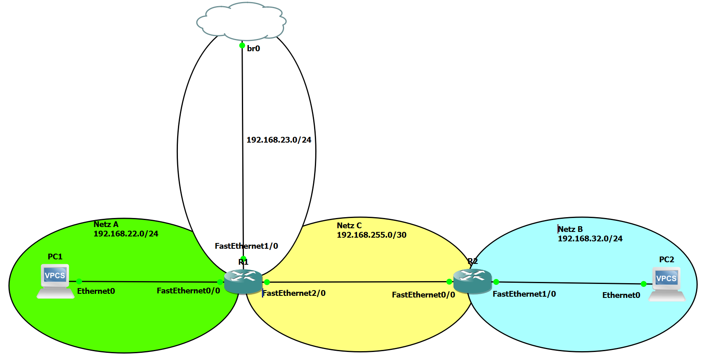

# Dokumentation Labor 3 - Ping über Router (3 Subnetze) und lokalem PC

 - Datum: 21.01.2022
 - Name: Marco Nemeth
 - [Link zur Aufgabenstellung](https://gitlab.com/ch-tbz-it/Stud/m129/-/tree/main/07_GNS3%20Labor%20Anforderungen#4-labor-3-ping-%C3%BCber-router-3-subnetze-und-lokalem-pc)



## Cloud1
 - br0 192.168.23.129
 - Eigener PC ist via OpenVPN (Layer2) mit br0 verbunden. 

## Config R1
 - [Cisco 7200](https://www.cisco.com/c/en/us/support/routers/7200-series-routers/series.html)
 - [GNS3 Cisco 7200](https://www.gns3.com/marketplace/appliances/cisco-7200)
 - 3 Interfaces Enabled (FastEthernet0/0, FastEthernet1/0, FastEthernet2/0)
```
R1# configure terminal
R1(config)# interface fastethernet0/0
R1(config-if)# ip addr 192.168.22.1 255.255.255.0
R1(config-if)# no shutdown
R1(config-if)# exit

R1(config)# interface fastethernet1/0
R1(config-if)# ip addr 192.168.23.5 255.255.255.0
R1(config-if)# no shutdown
R1(config-if)# exit

R1(config)# interface fastethernet2/0
R1(config-if)# ip addr 192.168.255.1 255.255.255.252
R1(config-if)# no shutdown
R1(config-if)# exit

R1(config)# ip route 192.168.32.0 255.255.255.0 192.168.255.2
R1(config)# exit

R1# copy running-config startup-config
```

## Config R2
 - [Cisco 7200](https://www.cisco.com/c/en/us/support/routers/7200-series-routers/series.html)
 - [GNS3 Cisco 7200](https://www.gns3.com/marketplace/appliances/cisco-7200)
 - 2 Interfaces Enabled (FastEthernet0/0, FastEthernet1/0)
```
R2# configure terminal

R2(config)# interface fastethernet0/0
R2(config-if)# ip addr 192.168.255.2 255.255.255.252
R2(config-if)# no shutdown
R2(config-if)# exit

R2(config)# interface fastethernet1/0
R2(config-if)# ip addr 192.168.32.1 255.255.255.0
R2(config-if)# no shutdown
R2(config-if)# exit

R2(config)# ip route 192.168.23.0 255.255.255.0 192.168.255.1
R2(config)# ip route 192.168.22.0 255.255.255.0 192.168.255.1
R2(config)# exit

R2# copy running-config startup-config
```

## Config VPC 1
- [GNS3 VPCS](https://docs.gns3.com/docs/emulators/vpcs/)
- 1x Ethernet Interface
```
set pcname PC1
# [IP] [MASKE] [GATEWAY]
ip 192.168.22.10 255.255.255.0 192.168.22.1
```

## Config VPC 2
- [GNS3 VPCS](https://docs.gns3.com/docs/emulators/vpcs/)
- 1x Ethernet Interface
```
set pcname PC2
# [IP] [MASKE] [GATEWAY]
ip 192.168.32.10 255.255.255.0 192.168.32.1
```

## Config Eigener Laptop
In *cmd.exe* als Admin:
```
route add 192.168.22.0 mask 255.255.255.0 192.168.23.5
route add 192.168.32.0 mask 255.255.255.0 192.168.23.5
```

## Quellen
 - https://www.howtogeek.com/howto/windows/adding-a-tcpip-route-to-the-windows-routing-table/
 - https://www.cisco.com/c/en/us/td/docs/routers/access/800M/software/800MSCG/routconf.html
 - https://www.davidc.net/sites/default/subnets/subnets.html
 - https://www.grandmetric.com/knowledge-base/design_and_configure/static-routing-configuration/
 - https://www.cisco.com/c/en/us/td/docs/routers/nfvis/switch_command/b-nfvis-switch-command-reference/ip_route_commands.pdf

## Neue Lerninhalte
 - Lokale Route auf auf einem Windows 10 PC konfigurieren
 - Cisco Router war für mich neu
 - IPv4-Adressen auf Router und PCs konfigurieren
 - Routing war für mich neu

## Reflexion
Ich finde, dass ich durch diese Übung viel gelernt habe und nun das Routen kennengelernt habe. Allgemein hat mir diese Aufgabe sehr gut geholfen, dass Thema besser zu verstehen und ich denke, dass ich die nächsten Labore mit Leichtigkeit lösen werden kann. Ich habe sehr viel Zeit beim Routen auf das 2. Netzwerk gebraucht, als ich es jedoch hingekriegt habe, war es für mich kinderleicht.
