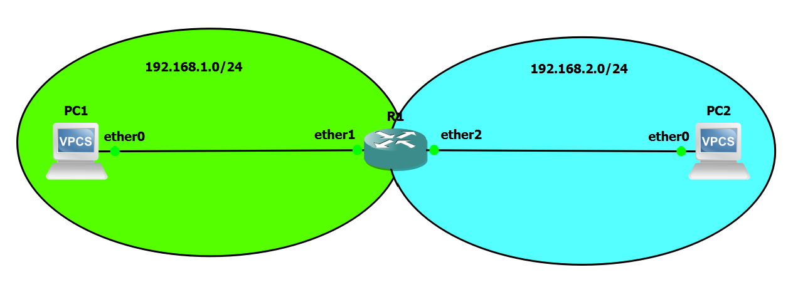

# Dokumentation Labor 2 - Labor mit zwei Router und DHCP Server

 - Datum: 14.01.2022
 - Name: Marco Nemeth
 - [Link zur Aufgabenstellung](https://gitlab.com/ch-tbz-it/Stud/m129/-/tree/main/07_GNS3%20Labor%20Anforderungen#3-labor-2-ping-mit-router)



## Cloud1
 - br0 192.168.23.129
 - Eigener PC ist via OpenVPN (Layer2) mit br0 verbunden. 

## Config R1
 - [MikroTik CHR 6.49.1](https://mikrotik.com/download/archive)
 - [GNS3 MikroTik CHR 6.49.1](https://gns3.com/marketplace/appliances/mikrotik-cloud-hosted-router)
 - 2 Interfaces Enabled (Ethernet1, Ethernet2)
```
[admin@R1] > system identity set name=R1

[admin@R1] > ip address add address=192.168.1.1/24 interface=ether1 network=192.168.1.0
[admin@R1] > ip address add address=192.168.2.1/24 interface=ether2 network=192.168.2.0
```

## Config VPC 1
- [GNS3 VPCS](https://docs.gns3.com/docs/emulators/vpcs/)
- 1x Ethernet Interface
```
PC1> set pcname PC1
PC1> ip 192.168.1.10 255.255.255.0 192.168.1.1
```

## Config VPC 2
- [GNS3 VPCS](https://docs.gns3.com/docs/emulators/vpcs/)
- 1x Ethernet Interface
```
PC2> set pcname PC2
PC2> ip 192.168.2.10 255.255.255.0 192.168.2.1
```

## Quellen
 - https://help.mikrotik.com/docs/display/ROS/RouterOS
 - https://stackoverflow.com/

## Neue Lerninhalte
 - Keine

## Reflexion
Diese Aufgabe war sehr einfach und ich konnte durch das diese auch sehr schnell lösen. Es gibt eigentlich nichts zum reflektieren.