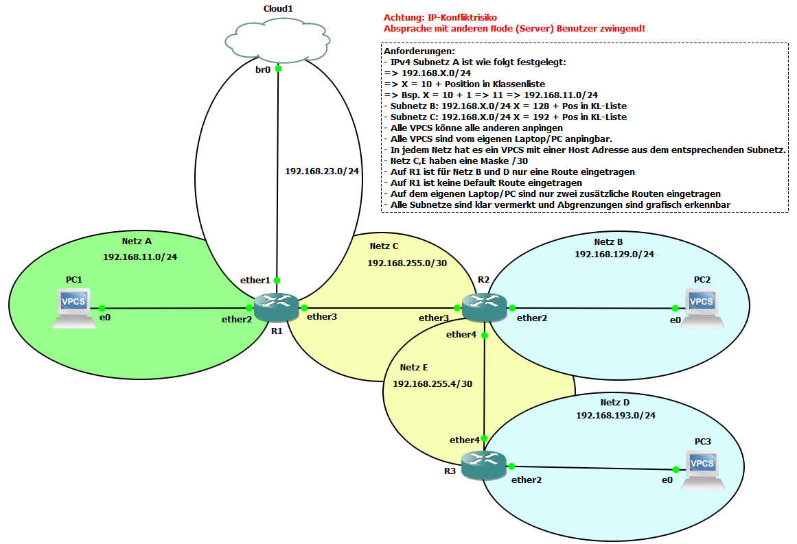

# Dokumentation Labor 4 - Aggregierte statische Routen

 - Datum: 28.01.2022
 - Name: Marco Nemeth
 - [Link zur Aufgabenstellung](https://gitlab.com/ch-tbz-it/Stud/m129/-/tree/main/07_GNS3%20Labor%20Anforderungen#5-labor-4-gns3-labor-4-aggregierte-statische-routen)



## Cloud1
 - br0 192.168.23.129
 - Eigener PC ist via OpenVPN (Layer2) mit br0 verbunden. 

## Config R1
 - [Cisco 7200](https://www.cisco.com/c/en/us/support/routers/7200-series-routers/series.html)
 - [GNS3 Cisco 7200](https://www.gns3.com/marketplace/appliances/cisco-7200)
 - 3 Interfaces Enabled (FastEthernet0/0, FastEthernet1/0, FastEthernet2/0)
```
R1# configure terminal
R1(config)# interface fastethernet0/0
R1(config-if)# ip addr 192.168.22.1 255.255.255.0
R1(config-if)# no shutdown
R1(config-if)# exit

R1(config)# interface fastethernet1/0
R1(config-if)# ip addr 192.168.23.5 255.255.255.0
R1(config-if)# no shutdown
R1(config-if)# exit

R1(config)# interface fastethernet2/0
R1(config-if)# ip addr 192.168.255.1 255.255.255.252
R1(config-if)# no shutdown
R1(config-if)# exit

R1(config)# ip route 192.168.128.0 255.255.128.0 192.168.255.2
R1(config)# exit

R1# copy running-config startup-config
```

## Config R2
 - [Cisco 7200](https://www.cisco.com/c/en/us/support/routers/7200-series-routers/series.html)
 - [GNS3 Cisco 7200](https://www.gns3.com/marketplace/appliances/cisco-7200)
 - 3 Interfaces Enabled (FastEthernet0/0, FastEthernet1/0, FastEthernet2/0)
```
R2# configure terminal

R2(config)# interface fastethernet0/0
R2(config-if)# ip addr 192.168.255.2 255.255.255.252
R2(config-if)# no shutdown
R2(config-if)# exit

R2(config)# interface fastethernet1/0
R2(config-if)# ip addr 192.168.140.1 255.255.255.0
R2(config-if)# no shutdown
R2(config-if)# exit

R2(config)# interface fastethernet2/0
R2(config-if)# ip addr 192.168.255.5 255.255.255.252
R2(config-if)# no shutdown
R2(config-if)# exit

R2(config)# ip route 192.168.23.0 255.255.255.0 192.168.255.1
R2(config)# ip route 192.168.22.0 255.255.255.0 192.168.255.1
R2(config)# ip route 192.168.204.0 255.255.255.0 192.168.255.6
R2(config)# exit

R2# copy running-config startup-config
```

## Config R3
 - [Cisco 7200](https://www.cisco.com/c/en/us/support/routers/7200-series-routers/series.html)
 - [GNS3 Cisco 7200](https://www.gns3.com/marketplace/appliances/cisco-7200)
 - 3 Interfaces Enabled (FastEthernet0/0, FastEthernet1/0)
```
R3# configure terminal

R3(config)# interface fastethernet0/0
R3(config-if)# ip addr 192.168.255.6 255.255.255.252
R3(config-if)# no shutdown
R3(config-if)# exit

R3(config)# interface fastethernet1/0
R3(config-if)# ip addr 192.168.204.1 255.255.255.0
R3(config-if)# no shutdown
R3(config-if)# exit

R3(config)# ip route 192.168.23.0 255.255.255.0 192.168.255.5
R3(config)# ip route 192.168.22.0 255.255.255.0 192.168.255.5
R3(config)# exit

R3# copy running-config startup-config
```

## Config VPC 1
- [GNS3 VPCS](https://docs.gns3.com/docs/emulators/vpcs/)
- 1x Ethernet Interface
```
set pcname PC1
# [IP] [MASKE] [GATEWAY]
ip 192.168.22.10 255.255.255.0 192.168.22.1
```

## Config VPC 2
- [GNS3 VPCS](https://docs.gns3.com/docs/emulators/vpcs/)
- 1x Ethernet Interface
```
set pcname PC2
# [IP] [MASKE] [GATEWAY]
ip 192.168.140.10 255.255.255.0 192.168.140.1
```

## Config VPC 3
- [GNS3 VPCS](https://docs.gns3.com/docs/emulators/vpcs/)
- 1x Ethernet Interface
```
set pcname PC2
# [IP] [MASKE] [GATEWAY]
ip 192.168.204.10 255.255.255.0 192.168.204.1
```

## Config Eigener Laptop
In *cmd.exe* als Admin:
```
route add 192.168.128.0 mask 255.255.128.0 192.168.23.5
```

## Quellen
 - https://www.howtogeek.com/howto/windows/adding-a-tcpip-route-to-the-windows-routing-table/
 - https://www.cisco.com/c/en/us/td/docs/routers/access/800M/software/800MSCG/routconf.html
 - https://www.davidc.net/sites/default/subnets/subnets.html
 - https://www.grandmetric.com/knowledge-base/design_and_configure/static-routing-configuration/
 - https://www.cisco.com/c/en/us/td/docs/routers/nfvis/switch_command/b-nfvis-switch-command-reference/ip_route_commands.pdf

## Neue Lerninhalte
 - Grosses Subnetz für mehrere kleine Subnetze verbinden

## Reflexion
Durch diese Übung konnte ich nochmals meine Routing Kenntnisse verbessern, da ich durch das alles verstanden habe.
