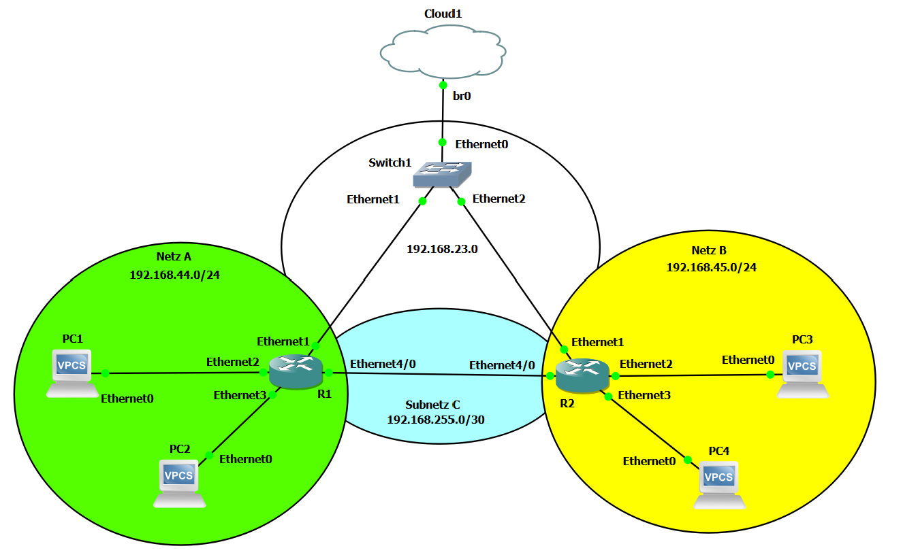

# Dokumentation Labor 5 - Labor mit zwei Router und DHCP Server

 - Datum: 04.02.2022
 - Name: Marco Nemeth
 - [Link zur Aufgabenstellung](https://gitlab.com/ch-tbz-it/Stud/m129/-/tree/main/07_GNS3%20Labor%20Anforderungen#6-labor-5-labor-mit-zwei-router-und-dhcp-server)



## Cloud1
 - br0 192.168.23.129
 - Eigener PC ist via OpenVPN (Layer2) mit br0 verbunden. 

## Config R1
 - [MikroTik CHR 6.49.1](https://mikrotik.com/download/archive)
 - [GNS3 MikroTik CHR 6.49.1](https://gns3.com/marketplace/appliances/mikrotik-cloud-hosted-router)
 - 4 Interfaces Enabled (Ethernet1, Ethernet2, Ethernet3, Ethernet4)
```
[admin@R1] > system identity set name=R1

[admin@R1] > interface bridge add name=NetzA
[admin@R1] > interface bridge port add bridge=NetzA interface=ether2
[admin@R1] > interface bridge port add bridge=NetzA interface=ether3

[admin@R1] > interface vlan add interface=NetzA name=NetzA_VLAN vlan-id=1

[admin@R1] > ip address add address=192.168.23.5/24 interface=ether1 network=192.168.23.0
[admin@R1] > ip address add address=192.168.44.1/24 interface=NetzA network=192.168.44.0
[admin@R1] > ip address add address=192.168.255.1/30 interface=ether4 network=192.168.255.0

[admin@R1] > ip dhcp-server setup

dhcp server interface: NetzA
dhcp address space: 192.168.44.0/24
gateway for dhcp network: 192.168.44.1
addresses to give out: 192.168.44.50-192.168.44.51
dns servers: 192.168.44.1
lease time: 10m

[admin@R1] > ip firewall filter add action=drop chain=forward dst-address=192.168.44.0/24 protocol=icmp src-address=192.168.23.0/24

[admin@R1] > ip route add dst-address=192.168.45.0/24 gateway=192.168.255.2
```

## Config R2
 - [MikroTik CHR 6.49.1](https://mikrotik.com/download/archive)
 - [GNS3 MikroTik CHR 6.49.1](https://gns3.com/marketplace/appliances/mikrotik-cloud-hosted-router)
 - 4 Interfaces Enabled (Ethernet1, Ethernet2, Ethernet3, Ethernet4)
```
[admin@R2] > system identity set name=R2

[admin@R2] > interface bridge add name=NetzB
[admin@R2] > interface bridge port add bridge=NetzB interface=ether2
[admin@R2] > interface bridge port add bridge=NetzB interface=ether3

[admin@R2] > interface vlan add interface=NetzB name=NetzB_VLAN vlan-id=1

[admin@R2] > ip address add address=192.168.23.6/24 interface=ether1 network=192.168.23.0
[admin@R2] > ip address add address=192.168.45.1/24 interface=NetzB network=192.168.45.0
[admin@R2] > ip address add address=192.168.255.2/30 interface=ether4 network=192.168.255.0

[admin@R2] > ip dhcp-server setup

dhcp server interface: NetzB
dhcp address space: 192.168.45.0/24
gateway for dhcp network: 192.168.45.1
addresses to give out: 192.168.45.50-192.168.45.51
dns servers: 192.168.45.1
lease time: 10m

[admin@R2] > ip route add dst-address=192.168.44.0/24 gateway=192.168.255.1
```

## Config VPC 1
- [GNS3 VPCS](https://docs.gns3.com/docs/emulators/vpcs/)
- 1x Ethernet Interface
```
PC1> set pcname PC1
PC1> dhcp
```

## Config VPC 2
- [GNS3 VPCS](https://docs.gns3.com/docs/emulators/vpcs/)
- 1x Ethernet Interface
```
PC2> set pcname PC2
PC2> dhcp
```

## Config VPC 3
- [GNS3 VPCS](https://docs.gns3.com/docs/emulators/vpcs/)
- 1x Ethernet Interface
```
PC3> set pcname PC3
PC3> dhcp
```

## Config VPC 4
- [GNS3 VPCS](https://docs.gns3.com/docs/emulators/vpcs/)
- 1x Ethernet Interface
```
PC4> set pcname PC4
PC4> dhcp
```

## Config Eigener Laptop
In *cmd.exe* als Admin:
```
C:\Users\nemeth> route add 192.168.44.0 mask 255.255.255.0 192.168.23.5
```

## Quellen
 - https://help.mikrotik.com/docs/display/ROS/RouterOS
 - https://stackoverflow.com/

## Neue Lerninhalte
 - DHCP Server aufsetzen
 - Mit MikroTik Router arbeiten

## Reflexion
Das DHCP Server aufsetzen hat mit Cisko geklappt, jedoch habe ich dort sehr viele Commands gebraucht und somit nicht mehr weitergemacht. Mit MikroTik war das ganze sehr einfach und ich konnte es ohne Probleme aufsetzen. Ich werde in Zukunft mit MikroTik arbeiten, da die Cisco Router im GNS3 bugs haben.