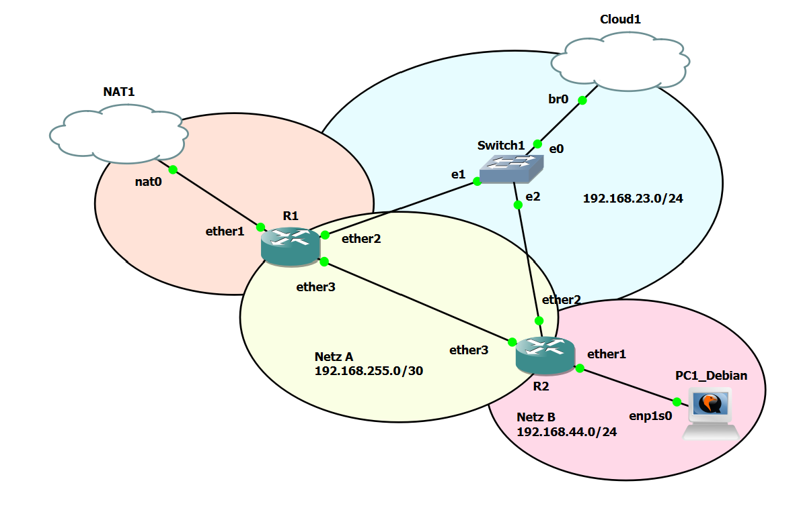

# Dokumentation Labor 6 - Labor mit zwei Router (NAT ins Internet), Debian Client

 - Datum: 04.02.2022
 - Name: Marco Nemeth
 - [Link zur Aufgabenstellung](https://gitlab.com/ch-tbz-it/Stud/m129/-/tree/main/07_GNS3%20Labor%20Anforderungen#7-labor-6-labor-mit-zwei-router-nat-ins-internet-debian-client)



## Cloud1
 - br0 192.168.23.129
 - Eigener PC ist via OpenVPN (Layer2) mit br0 verbunden. 

## NAT1
 - nat0 192.168.122.0/24

## Config R1
 - [MikroTik CHR 6.49.1](https://mikrotik.com/download/archive)
 - [GNS3 MikroTik CHR 6.49.1](https://gns3.com/marketplace/appliances/mikrotik-cloud-hosted-router)
 - 3 Interfaces Enabled (Ethernet1, Ethernet2, Ethernet3)
```
[admin@R1] > system identity set name=R1

[admin@R1] > ip address add address=192.168.255.1 interface=ether3 network=192.168.255.0
[admin@R1] > ip dhcp-client add interface=ether1 disabled=no

[admin@R1] > ip dhcp-client edit ether2 add-default-route
no

[admin@R1] > ip firewall nat add action=masquerade chain=srcnat out-interface=ether1

[admin@R1] > ip route add dst-address=0.0.0.0/0 gateway=192.168.122.1
```

## Config R2
 - [MikroTik CHR 6.49.1](https://mikrotik.com/download/archive)
 - [GNS3 MikroTik CHR 6.49.1](https://gns3.com/marketplace/appliances/mikrotik-cloud-hosted-router)
 - 3 Interfaces Enabled (Ethernet1, Ethernet2, Ethernet3)
```
[admin@R2] > system identity set name=R2

[admin@R2] > ip address add address=192.168.44.1/24 interface=ether1 network=192.168.44.0
[admin@R2] > ip address add address=192.168.255.2/30 interface=ether3 network=192.168.255.0

[admin@R1] > ip dhcp-client edit ether2 add-default-route
no

[admin@R2] > ip dhcp-server setup

dhcp server interface: ether1
dhcp address space: 192.168.44.0/24
gateway for dhcp network: 192.168.44.1/24
addresses to give out: 192.168.44.50-192.168.44.150
dns servers: 8.8.8.8
lease time: 10m

[admin@R2] > ip firewall nat add action=masquerade chain=srcnat out-interface=ether3

[admin@R2] > ip route add dst-address=0.0.0.0/0 gateway=192.168.255.1
```

## Config PC1_Debian
- 1x Ethernet Interface
```
PC ANS NAT1 ANSCHLIESSEN
----------------------------------
HDD Setzen auf 20 GB
sudo nano /etc/network/interfaces
 - auto ens3
 - iface ens3 inet dhcp

sudo apt update
sudo apt upgrade
sudo apt install lxde
reboot
----------------------------------
PC AN R2 ANSCHLIESSEND
```

## Quellen
 - Kenntnisse :)

## Neue Lerninhalte
 - Keine

## Reflexion
Viel habe ich nicht gelernt, da ich das Labor 7 davor gemacht habe und das ganze übernehmen konnte.