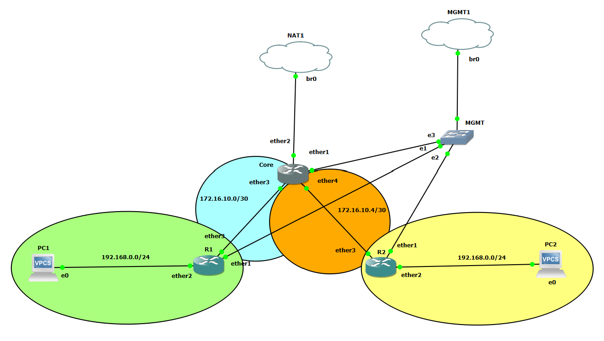

# Dokumentation Labor 7 - Erweiterung Labor 6 mit Firewall

 - Datum: 04.02.2022
 - Name: Marco Nemeth
 - [Link zur Aufgabenstellung](https://gitlab.com/ch-tbz-it/Stud/m129/-/tree/main/07_GNS3%20Labor%20Anforderungen#8-labor-7-erweiterung-labor-6-mit-firewall)



## Cloud1
 - br0 192.168.23.129
 - Eigener PC ist via OpenVPN (Layer2) mit br0 verbunden. 

## NAT1
 - br0 192.168.123.0/24

## Config Core
 - [MikroTik CHR 6.49.1](https://mikrotik.com/download/archive)
 - [GNS3 MikroTik CHR 6.49.1](https://gns3.com/marketplace/appliances/mikrotik-cloud-hosted-router)
 - 4 Interfaces Enabled (Ethernet1, Ethernet2, Ethernet3, Ethernet4)
```
[admin@Core] > system identity set name=Core

[admin@Core] > ip address add address=192.168.23.5/24 interface=ether1 network=192.168.23.0
[admin@Core] > ip address add address=172.16.10.1/30 interface=ether3 network=172.16.10.0
[admin@Core] > ip address add address=172.16.10.5/30 interface=ether4 network=172.16.10.4
[admin@Core] > ip dhcp-client add interface=ether2 disabled=no

[admin@R1] > ip dhcp-client edit ether1 add-default-route
no

[admin@Core] > ip firewall nat add action=masquerade chain=srcnat out-interface=ether2

[admin@Core] > ip route add dst-address=0.0.0.0/0 gateway=192.168.122.1
```

## Config R1
 - [MikroTik CHR 6.49.1](https://mikrotik.com/download/archive)
 - [GNS3 MikroTik CHR 6.49.1](https://gns3.com/marketplace/appliances/mikrotik-cloud-hosted-router)
 - 3 Interfaces Enabled (Ethernet1, Ethernet2, Ethernet3)
```
[admin@R1] > system identity set name=R1

[admin@R1] > ip address add address=192.168.23.6/24 interface=ether1 network=192.168.23.0
[admin@R1] > ip address add address=192.168.0.1/24 interface=ether2 network=192.168.0.0
[admin@R1] > ip address add address=172.16.10.2/30 interface=ether3 network=172.16.10.0

[admin@R1] > ip dhcp-server setup

dhcp server interface: ether2
dhcp address space: 192.168.0.0/24
gateway for dhcp network: 192.168.0.1
addresses to give out: 192.168.0.50-192.168.0.150
dns servers: 8.8.8.8
lease time: 10m

[admin@R1] > ip dhcp-client edit ether1 add-default-route
no

[admin@R1] > ip firewall nat add action=masquerade chain=srcnat out-interface=ether3

[admin@R1] > ip route add dst-address=0.0.0.0/0 gateway=172.16.10.1
```

## Config R2
 - [MikroTik CHR 6.49.1](https://mikrotik.com/download/archive)
 - [GNS3 MikroTik CHR 6.49.1](https://gns3.com/marketplace/appliances/mikrotik-cloud-hosted-router)
 - 3 Interfaces Enabled (Ethernet1, Ethernet2, Ethernet3)
```
[admin@R2] > system identity set name=R1

[admin@R2] > ip address add address=192.168.23.7/24 interface=ether1 network=192.168.23.0
[admin@R2] > ip address add address=192.168.0.1/24 interface=ether2 network=192.168.0.0
[admin@R2] > ip address add address=172.16.10.6/30 interface=ether3 network=172.16.10.4

[admin@R2] > ip dhcp-server setup

dhcp server interface: ether2
dhcp address space: 192.168.0.0/24
gateway for dhcp network: 192.168.0.1
addresses to give out: 192.168.0.50-192.168.0.150
dns servers: 8.8.8.8
lease time: 10m

[admin@R1] > ip dhcp-client edit ether1 add-default-route
no

[admin@R2] > ip firewall nat add action=masquerade chain=srcnat out-interface=ether3

[admin@R2] > ip route add dst-address=0.0.0.0/0 gateway=172.16.10.5
```

## Config VPC 1
- [GNS3 VPCS](https://docs.gns3.com/docs/emulators/vpcs/)
- 1x Ethernet Interface
```
PC1> set pcname PC1
PC1> dhcp
```

## Config VPC 2
- [GNS3 VPCS](https://docs.gns3.com/docs/emulators/vpcs/)
- 1x Ethernet Interface
```
PC2> set pcname PC2
PC2> dhcp
```

## Quellen
 - https://help.mikrotik.com/docs/display/ROS/RouterOS
 - https://stackoverflow.com/

## Neue Lerninhalte
 - Firewall Masquerade 

## Reflexion
In diesem Labor konnte ich den Masquerade Command kennenlernen, mit welchem ich den Zugang ins Internet machen kann. Ich habe das NAT Prinzip jetzt besser verstanden.
